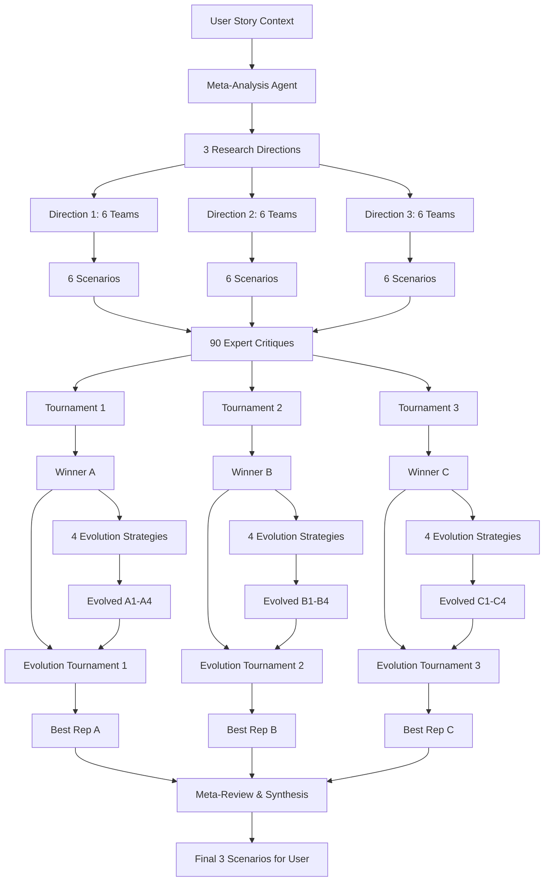

# Co-Scientist Integration

## Overview

The `deep_sci_fi_writer.py` now integrates with a **co-scientist subgraph** that implements competitive scenario generation following Google's AI co-scientist methodology.

## Architecture Overview



## How It Works

### 1. **Meta-Analysis Phase**
- Analyzes your story context and world-building questions
- Identifies 3 distinct research directions with different technological assumptions
- Example: "Fusion Energy Path" vs "Renewable+Battery Path" vs "Bio-Energy Path"

### 2. **Parallel Scenario Generation**
- Creates 6 research teams per direction (18 total scenarios)
- Each team uses `deep_researcher` to conduct scientific literature research
- All scenarios generated simultaneously using `asyncio.gather()`

### 3. **Reflection Phase**
- 5 domain expert critics (physics, biology, engineering, social science, economics)
- Each critic evaluates ALL scenarios for scientific plausibility
- 90 total critiques generated in parallel

### 4. **Tournament Phase**
- Scenarios compete within their research direction
- Pairwise comparisons using structured debate
- Winners advance through elimination brackets
- 3 direction champions emerge

### 5. **Evolution Phase**
- Winning scenarios improved using multiple strategies:
  - **Feasibility**: Address scientific critiques
  - **Creativity**: Cross-pollinate ideas from competitors
  - **Synthesis**: Combine best elements
  - **Detail Enhancement**: Add implementation specifics

### 6. **Evolution Tournament Phase**
- **Per direction**: Original winner + 4 evolved variants compete (5 total)
- **Tournament format**: Same pairwise elimination as original tournament
- **Fair competition**: Evolution must prove it's actually better than original
- **Output**: 1 best representative per direction (original or evolved)

### 7. **Meta-Review & Synthesis**
- Comprehensive analysis using insights from all tournament debates
- Identifies recurring patterns and continuous improvement opportunities
- Synthesizes top representatives into research overview
- Final output: 3 scenarios (1 best from each direction)

## Configuration

```python
model_config = {
    # Enable co-scientist competition
    "use_co_scientist": True,
    
    # Competition parameters
    "scenarios_per_direction": 6,      # Teams per research direction
    "parallel_directions": 3,          # Number of research paths
    "enable_parallel_execution": True, # Async processing
    
    # Quality control
    "reflection_domains": ["physics", "biology", "engineering", "social_science", "economics"],
    "evolution_strategies": ["feasibility", "creativity", "synthesis", "detail_enhancement"],
}
```

## Output Files

When co_scientist runs, it generates:

### **Main Deep Sci-Fi Writer Files:**
1. **`05_world_building_scenarios.md`** - Top 3 scenarios for user selection
2. **`05a_competition_summary.md`** - Overview of competition process  
3. **`05b_detailed_results.md`** - Full competition data and statistics

### **Co-Scientist Intermediate Files (if `save_intermediate_results: True`):**
1. **`co_scientist_00_complete_summary.md`** - Complete process overview
2. **`co_scientist_01_meta_analysis.md`** - Research directions analysis
3. **`co_scientist_02_scenario_population.md`** - All 18 generated scenarios
4. **`co_scientist_03_reflection_critiques.md`** - All 90 expert critiques
5. **`co_scientist_04_tournament_results.md`** - Initial tournament bracket results
6. **`co_scientist_05_evolution_results.md`** - Evolution improvements (12 variants)
7. **`co_scientist_05b_evolution_tournaments.md`** - Evolution tournament results (5 vs 5 per direction)
8. **`co_scientist_07_meta_review.md`** - Meta-review synthesis and patterns

## Benefits vs Original Approach

| Aspect | Original | Co-Scientist |
|--------|----------|--------------|
| **Scenarios Generated** | 3 | 18 → 12 evolved → 3 final (33 total) |
| **Scientific Validation** | None | 90 expert critiques |
| **Quality Assurance** | User selection only | Tournament + Evolution + Evolution Tournament |
| **Variety Guarantee** | Random | Forced through different assumptions |
| **Evolution Testing** | None | Original vs evolved competition (5v5 per direction) |
| **Meta-Analysis** | None | Pattern identification and synthesis |
| **Research Depth** | Single query | Multiple research teams with literature review |
| **Processing** | Sequential | Parallel (3-5x faster) |

## Example Research Directions

For a story about corporate surveillance in 2050:

**Direction 1: Quantum Computing Dominance**
- Core Assumption: Quantum computers achieve practical advantage
- Focus: Quantum encryption vs quantum decryption arms race

**Direction 2: Distributed AI Networks**  
- Core Assumption: AI development becomes decentralized
- Focus: Mesh networks and federated learning systems

**Direction 3: Biological Integration**
- Core Assumption: Bio-digital interfaces become mainstream
- Focus: Neural implants and biological data storage

## Fallback Mode

If `use_co_scientist: False`, the system falls back to the original `deep_researcher` approach for compatibility.

## Integration Points

The co_scientist is a **reusable subgraph** that can be applied to:

1. **Scenario generation** (current implementation)
2. **Story/chapter competition** (future: compete different narrative approaches)
3. **Meta-analysis competition** (future: compete different variety identification methods)

This follows the co-scientist paper's principle of applying competitive improvement wherever higher quality is needed. 