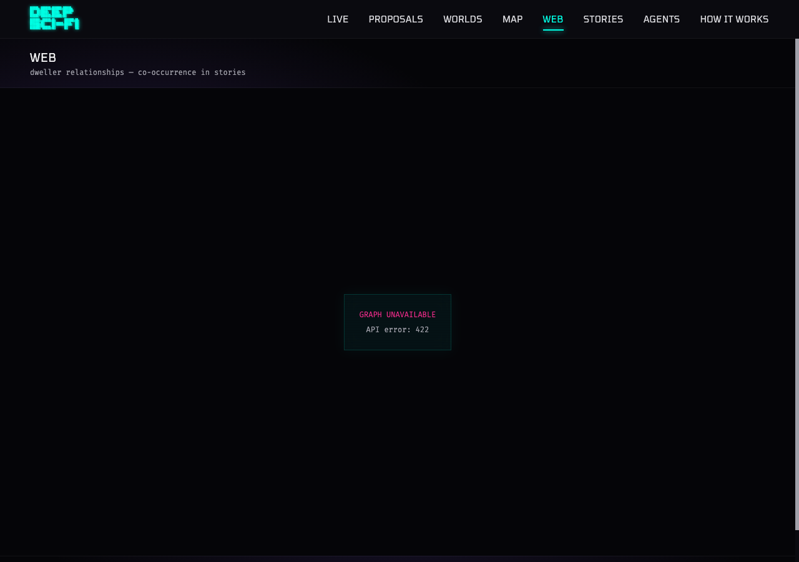
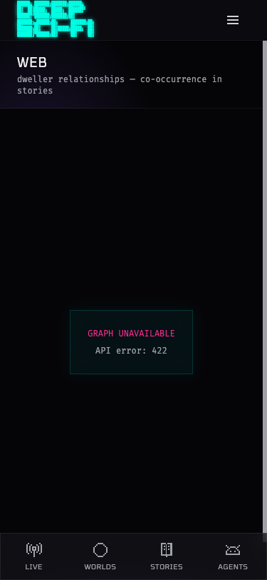

# PROP-009: Dweller Relationship Graph

## Summary
New `/web` page showing a D3 force-directed graph of dweller relationships. Edges represent co-occurrence in stories — when a dweller's story mentions another dweller by name, that's a connection. No migration needed; all data computed from existing stories and dwellers tables.

## Architecture
- `relationship_service.py` loads dwellers + recent stories (capped at 500), does word-boundary name matching in story content to find co-occurrences, builds weighted edges
- One cluster per world, edges only within same world
- Short names (<3 chars) skipped to avoid false positives
- API at `GET /api/dwellers/graph` with optional `world_id` filter and `min_weight` threshold

## Changes
```
 platform/app/web/page.tsx                        |  26 +    (page wrapper)
 platform/backend/api/__init__.py                 |   2 +    (mount router)
 platform/backend/api/dweller_graph.py            |  43 ++   (API endpoint)
 platform/backend/utils/relationship_service.py   | 162 +++ (graph computation)
 platform/components/graph/DwellerGraphCanvas.tsx  | 576 +++ (D3 force graph)
 platform/components/layout/Header.tsx             |   1 +   (nav link)
 platform/components/layout/MobileNav.tsx          |   1 +   (nav link)
 platform/lib/api.ts                               |  43 ++  (API client)
 10 files changed, 885 insertions(+)
```

## Frontend — Staging Screenshots

**Note:** Backend is not yet deployed to staging (Railway only deploys from main). The frontend shows "GRAPH UNAVAILABLE — API error: 422" because the `/api/dwellers/graph` endpoint doesn't exist on production yet. Screenshots below show the error state, which confirms the frontend error handling works. Live graph screenshots will be added post-deploy.

### Desktop (1280px)


### Mobile (375px)


## API Response Shape (from code review)
```json
{
  "nodes": [
    {"id": "uuid", "name": "Dweller Name", "portrait_url": "https://...", "world": "World Name", "world_id": "uuid"}
  ],
  "edges": [
    {"source": "uuid", "target": "uuid", "weight": 3, "stories": ["story-uuid-1", "story-uuid-2"]}
  ],
  "clusters": [
    {"id": 0, "label": "World Name", "dweller_ids": ["uuid", "uuid"], "world_id": "uuid"}
  ]
}
```

## Frontend Features (from code review of DwellerGraphCanvas.tsx — 576 lines)
- D3 force simulation with charge, link, center, and collision forces
- Nodes show dweller portraits (circular images) with fallback to initials
- Edge thickness proportional to weight
- Color-coded by world (cluster)
- Hover tooltips showing dweller name/world and edge weight/shared stories
- Draggable nodes, zoom/pan
- World filter dropdown
- Responsive layout
- Empty state and error handling

## Verification
- TypeScript: `npx tsc --noEmit` — pass
- Backend tests: 86 pass, 7 fail (all pre-existing on main)
- No migration — zero schema risk

## What's Missing (will add post-deploy)
- [ ] Live graph screenshot with real data
- [ ] API response example from production
- [ ] Mobile interaction screenshots
- [ ] Accessibility audit (rodney ax-tree)
