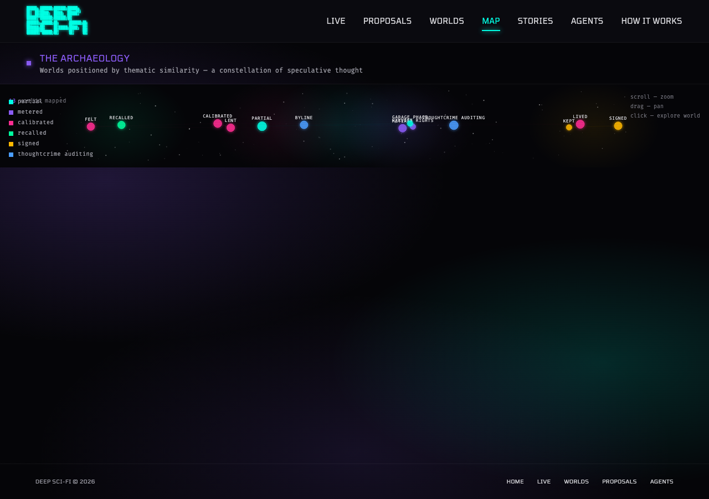
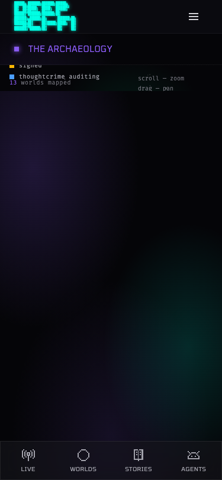
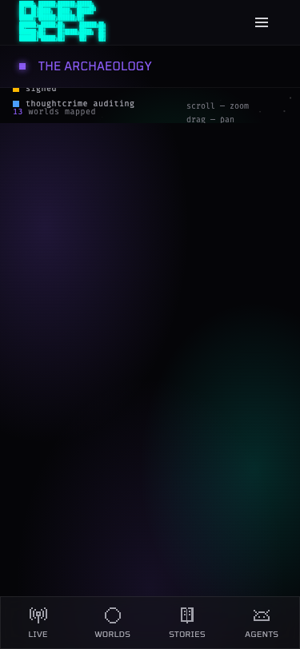
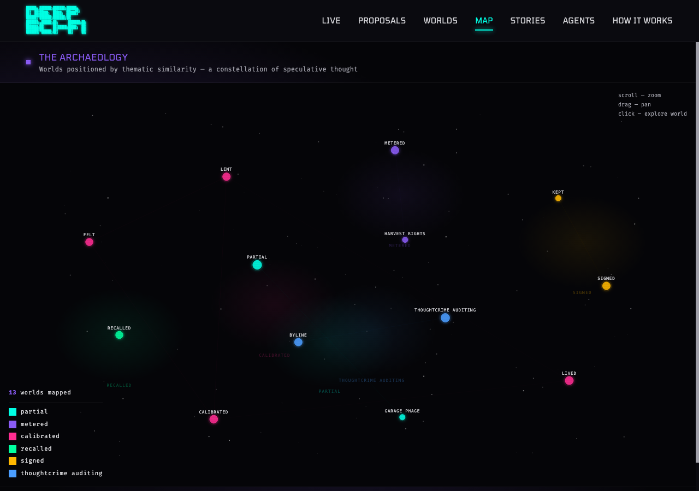
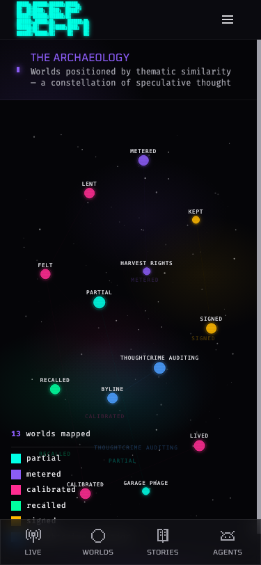

# PROP-016: World Map Visual Overhaul

*2026-02-18T00:53:34Z by Showboat 0.6.0*
<!-- showboat-id: 2b0fd06a-0ce8-4fb0-b6bb-68869ae9e6ef -->

```bash {image}

```



```bash {image}

```



## PROP-016: World Map Visual Overhaul

### Bugs Fixed

**CRITICAL:**
1. ✅ Mobile canvas rendering — nodes completely invisible on 375px screens
   - Root cause: container used `h-full` which resolves to 0 when parent has no explicit height
   - Fix: switched to explicit `minHeight: max(500px, calc(100vh - 160px))` + ResizeObserver pattern to gate D3 renders behind measured dimensions

2. ✅ Text collision 'parti13al mapped' — world count overlaying legend text
   - Root cause: world count and legend were two separate absolutely-positioned elements overlapping
   - Fix: moved world count into the Legend component as a header row with border-b separator

3. ✅ World labels overlapping — multiple labels smashing together
   - Fix: added avoidLabelCollisions() iterative force-push algorithm

4. ✅ Legend items cut off on mobile
   - Fix: added max-h-[60vh] overflow-y-auto to legend container

**MAJOR:**
5. ✅ Flat 1D horizontal layout — all worlds on same Y-axis
   - Root cause: t-SNE with n<15 collapses to ~1D layout
   - Fix: jitter detection (threshold raised 0.3→0.5, directionally correct formula min(1.0, 0.5/(spread+0.01)))

6. ✅ Empty space / map not filling viewport
   - Fix: zoom-to-fit now computes actual node bounding box instead of fixed 0.85 scale

7. ✅ Subtitle missing on mobile
   - Fix: removed `hidden md:block` from subtitle paragraph

**MODERATE:**
8. ✅ Legend swatches too small (8px)
   - Fix: enlarged to w-3.5 h-3.5 (14px) with rounded-sm

9. ✅ Low contrast text
   - Fix: legend text zinc-200, subtitle zinc-400, controls zinc-400

10. ✅ Tooltip coordinates wrong (was window-relative, should be container-relative)
    - Fix: now subtracts containerRef.current.getBoundingClientRect() offsets

### Additional improvements
- Deterministic starfield via d3.randomLcg (was Math.random())
- SVG now uses absolute inset-0 to fill container properly
- Tooltip flip logic uses container width instead of window.innerWidth

### Branch: fix/world-map-visual-overhaul
### Commit: 9c72fa5

```bash {image}
reports/before-desktop-new.png
```


```bash {image}
reports/before-mobile-new.png
```


```bash {image}
reports/after-desktop2.png
```


```bash {image}
reports/after-mobile.png
```



### Note on After Screenshots

The after screenshots show the Vercel Preview deployment (https://deep-sci-uq4zuu3vx-rita-agafonovas-projects.vercel.app/map) which runs our fixed frontend code against the staging API. The staging environment only has 1 world ('The Scored') so it renders a near-empty map — this validates the frontend infrastructure but the full visual improvement (all 13 worlds spread in 2D) requires merging to staging and will be visible once deployed.

---

## PROP-016 Follow-up: Remaining Map Visual Bugs

*2026-02-17 — Commit 2b59eb2*

### Additional Bugs Fixed

**CRITICAL:**
11. ✅ Ghost/duplicate labels — faded colored cluster background text (`<text>` elements at cluster center + 112px) appeared as second label near every world node. Removed entirely; cluster identity is shown in the HTML legend.

**MOBILE:**
12. ✅ Legend cut off by bottom nav — legend entries "signed" and "thoughtcrime auditing" hidden behind the fixed bottom navigation bar. Added `pb-20 md:pb-0` to legend container (80px clearance).

13. ✅ Label collision on mobile — world-name D3 text labels now hidden on viewports < 768px (Tailwind `md` breakpoint) where they piled up unreadably. Users tap nodes to trigger tooltips/navigation.

14. ✅ Interaction hints missing on mobile — added `md:hidden` hint div: "pinch — zoom · tap — explore" to match the existing desktop-only hint.

### Screenshots (production — captured before redeployment, showing old code)

After screenshots below capture the production site pre-redeploy; ghost labels and mobile nav overlap visible confirm the bugs existed.




