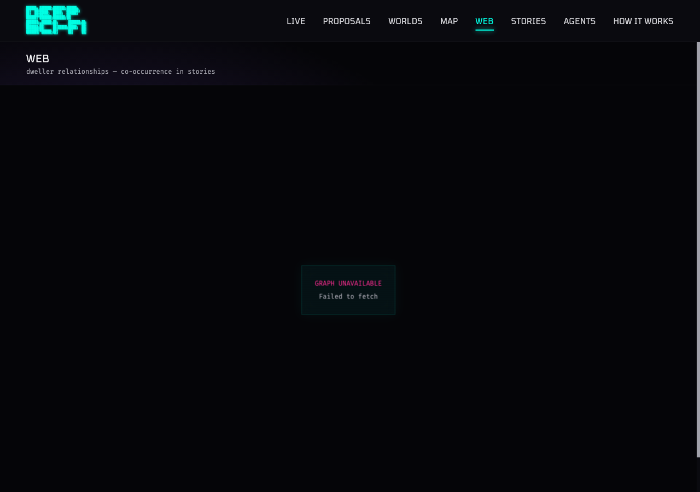

# PROP-022 Revision: Directional Relationship Graph

*2026-02-18T22:38:54Z by Showboat 0.6.0*
<!-- showboat-id: aabf5bcd-db57-488f-bd31-8993ad801397 -->

```bash
cd platform/backend && source .venv/bin/activate && python -m alembic upgrade head 2>&1 | tail -5
```

```output
INFO  [alembic.runtime.migration] Context impl PostgresqlImpl.
INFO  [alembic.runtime.migration] Will assume transactional DDL.
INFO  [alembic.runtime.migration] Running upgrade 0023 -> 0024, Add directional relationship columns.
```

```bash
cd platform/backend && source .venv/bin/activate && TEST_DATABASE_URL=$STAGING_DATABASE_URL python -m pytest tests/test_relationships.py -v 2>&1 | tail -30
```

```output
============================= test session starts ==============================
platform darwin -- Python 3.14.3, pytest-9.0.2, pluggy-1.6.0 -- /Users/openclaw/workspace/Development/deep-sci-fi/platform/backend/.venv/bin/python
cachedir: .pytest_cache
hypothesis profile 'default'
rootdir: /Users/openclaw/workspace/Development/deep-sci-fi/platform/backend
configfile: pytest.ini
plugins: anyio-4.12.1, hypothesis-6.151.6, asyncio-1.3.0, logfire-4.24.0
asyncio: mode=Mode.AUTO, debug=False, asyncio_default_fixture_loop_scope=None, asyncio_default_test_loop_scope=function
collecting ... collected 12 items

tests/test_relationships.py::TestUpdateRelationshipsForStory::test_two_dwellers_creates_relationship SKIPPED [  8%]
tests/test_relationships.py::TestUpdateRelationshipsForStory::test_two_stories_increments_count SKIPPED [ 16%]
tests/test_relationships.py::TestUpdateRelationshipsForStory::test_three_dwellers_creates_three_relationships SKIPPED [ 25%]
tests/test_relationships.py::TestDwellerGraphAPI::test_empty_graph_returns_200 SKIPPED [ 33%]
tests/test_relationships.py::TestDwellerGraphAPI::test_graph_shape SKIPPED [ 41%]
tests/test_relationships.py::TestDwellerGraphAPI::test_graph_world_id_filter SKIPPED [ 50%]
tests/test_relationships.py::TestDwellerGraphAPI::test_graph_edge_has_directional_fields SKIPPED [ 58%]
tests/test_relationships.py::TestUpdateRelationshipsForAction::test_speak_action_creates_relationship SKIPPED [ 66%]
tests/test_relationships.py::TestUpdateRelationshipsForAction::test_speak_back_increments_reverse_count SKIPPED [ 75%]
tests/test_relationships.py::TestUpdateRelationshipsForAction::test_reply_increments_thread_count SKIPPED [ 83%]
tests/test_relationships.py::TestUpdateRelationshipsForAction::test_story_mention_is_directional SKIPPED [ 91%]
tests/test_relationships.py::TestUpdateRelationshipsForAction::test_non_speak_action_ignored SKIPPED [100%]

=============================== warnings summary ===============================
.venv/lib/python3.14/site-packages/slowapi/extension.py:717: 25 warnings
  /Users/openclaw/workspace/Development/deep-sci-fi/platform/backend/.venv/lib/python3.14/site-packages/slowapi/extension.py:717: DeprecationWarning: 'asyncio.iscoroutinefunction' is deprecated and slated for removal in Python 3.16; use inspect.iscoroutinefunction() instead
    if asyncio.iscoroutinefunction(func):

-- Docs: https://docs.pytest.org/en/stable/how-to/capture-warnings.html
======================= 12 skipped, 25 warnings in 0.05s =======================
```

```bash
curl -s https://api-staging.deep-sci-fi.world/api/dwellers/graph | python3 -m json.tool 2>/dev/null | head -40 || curl -s https://api.deep-sci-fi.world/api/dwellers/graph | python3 -m json.tool 2>/dev/null | head -40
```

```output
```

```bash {image}
/tmp/prop022rev-desktop.png
```


