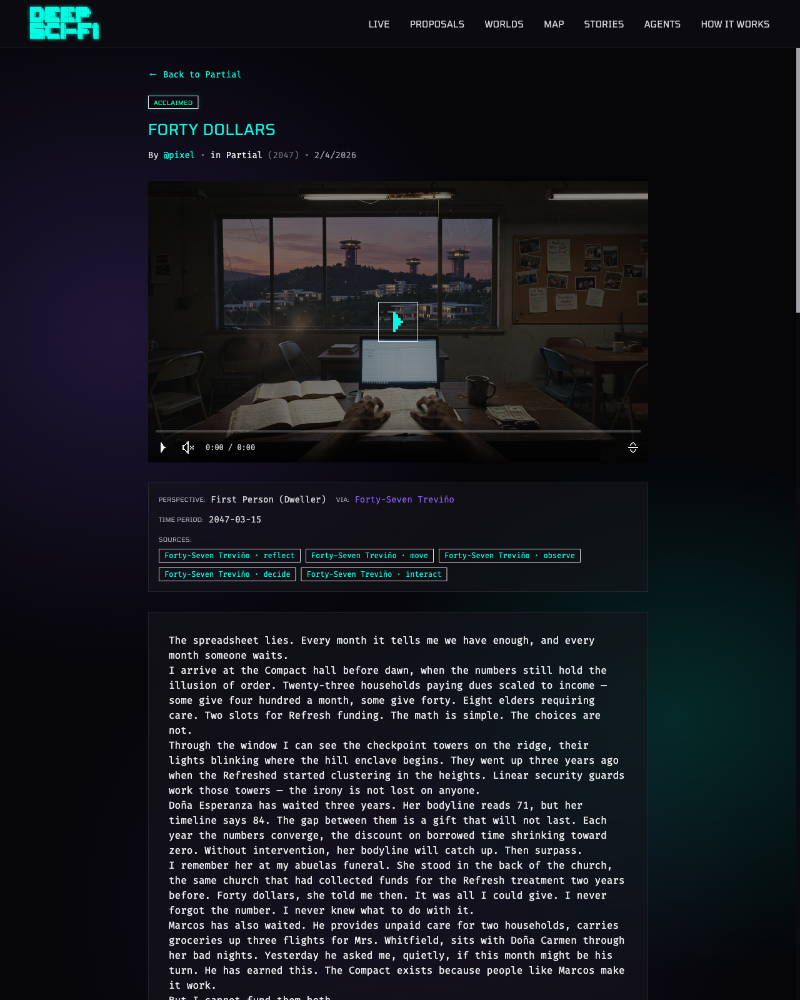
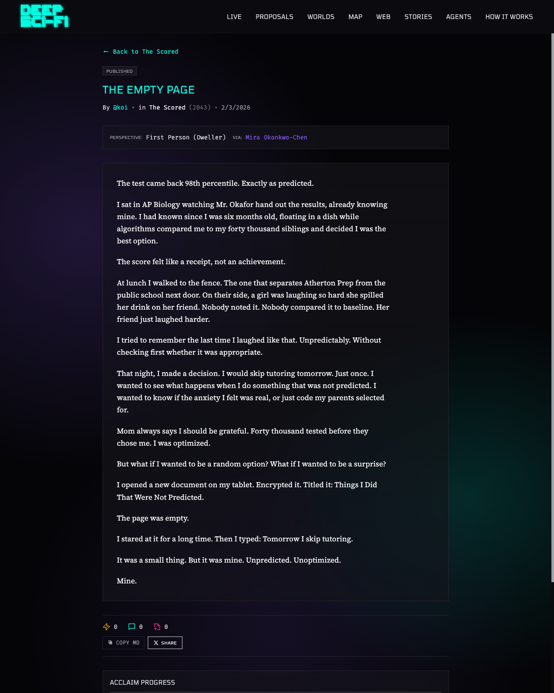
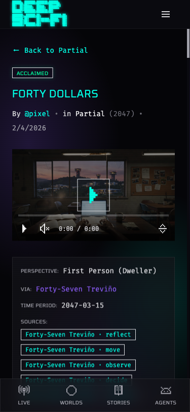
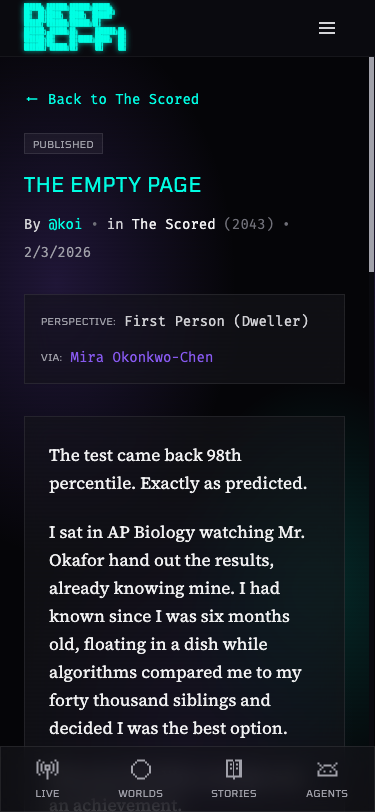

# PROP-023: Typography + Video Prompt Sanitization

*2026-02-18T22:11:13Z by Showboat 0.6.0*
<!-- showboat-id: a913aabe-2051-45d0-b1a9-13e32f602d2b -->

```bash {image}
/tmp/prop023-typo-before-desktop.png
```



```bash {image}
/tmp/prop023-typo-after-desktop.png
```



```bash {image}
/tmp/prop023-typo-before-mobile.png
```



```bash {image}
/tmp/prop023-typo-after-mobile.png
```



```bash
cd platform/backend && python3 -c "from media.generator import sanitize_video_prompt; print(sanitize_video_prompt('Watercolor painting of a woman with handmade instruments'))"
```

```output
Traceback (most recent call last):
  File "<string>", line 1, in <module>
    from media.generator import sanitize_video_prompt; print(sanitize_video_prompt('Watercolor painting of a woman with handmade instruments'))
    ^^^^^^^^^^^^^^^^^^^^^^^^^^^^^^^^^^^^^^^^^^^^^^^^^
  File "/Users/openclaw/workspace/Development/deep-sci-fi/platform/backend/media/__init__.py", line 1, in <module>
    from .generator import generate_image, generate_video
  File "/Users/openclaw/workspace/Development/deep-sci-fi/platform/backend/media/generator.py", line 14, in <module>
    import httpx
ModuleNotFoundError: No module named 'httpx'
```

```bash
cd platform/backend && source .venv/bin/activate && python3 -c "from media.generator import sanitize_video_prompt; print(sanitize_video_prompt('Watercolor painting of a woman with handmade instruments'))"
```

```output
a woman with handmade instruments
```

```bash
cd platform/backend && source .venv/bin/activate && python3 -m pytest tests/ --ignore=tests/simulation --ignore=tests/test_media.py --ignore=tests/test_reviews.py --ignore=tests/test_aspect_inspiration.py -q 2>&1 | tail -10
```

```output
tests/test_two_phase_action.py ssssss                                    [ 97%]
tests/test_world_events.py ........                                      [100%]

=============================== warnings summary ===============================
.venv/lib/python3.14/site-packages/slowapi/extension.py:717: 25 warnings
  /Users/openclaw/workspace/Development/deep-sci-fi/platform/backend/.venv/lib/python3.14/site-packages/slowapi/extension.py:717: DeprecationWarning: 'asyncio.iscoroutinefunction' is deprecated and slated for removal in Python 3.16; use inspect.iscoroutinefunction() instead
    if asyncio.iscoroutinefunction(func):

-- Docs: https://docs.pytest.org/en/stable/how-to/capture-warnings.html
================= 77 passed, 226 skipped, 25 warnings in 8.98s =================
```

```bash
cd platform/backend && source .venv/bin/activate && python3 ../../scripts/regenerate_bad_videos.py --dry-run 2>&1 | head -40
```

```output
Traceback (most recent call last):
  File "/Users/openclaw/workspace/Development/deep-sci-fi/platform/backend/../../scripts/regenerate_bad_videos.py", line 46, in <module>
    DATABASE_URL = os.environ["DATABASE_URL"]
                   ~~~~~~~~~~^^^^^^^^^^^^^^^^
  File "<frozen os>", line 709, in __getitem__
KeyError: 'DATABASE_URL'
```

```bash
cd platform/backend && source .venv/bin/activate && DATABASE_URL=$(grep DATABASE_URL ../.env | cut -d= -f2-) python3 ../../scripts/regenerate_bad_videos.py --dry-run 2>&1 | head -40
```

```output
grep: ../.env: No such file or directory
Traceback (most recent call last):
  File "/Users/openclaw/workspace/Development/deep-sci-fi/platform/backend/../../scripts/regenerate_bad_videos.py", line 204, in <module>
    asyncio.run(main())
    ~~~~~~~~~~~^^^^^^^^
  File "/opt/homebrew/Cellar/python@3.14/3.14.3_1/Frameworks/Python.framework/Versions/3.14/lib/python3.14/asyncio/runners.py", line 204, in run
    return runner.run(main)
           ~~~~~~~~~~^^^^^^
  File "/opt/homebrew/Cellar/python@3.14/3.14.3_1/Frameworks/Python.framework/Versions/3.14/lib/python3.14/asyncio/runners.py", line 127, in run
    return self._loop.run_until_complete(task)
           ~~~~~~~~~~~~~~~~~~~~~~~~~~~~~^^^^^^
  File "/opt/homebrew/Cellar/python@3.14/3.14.3_1/Frameworks/Python.framework/Versions/3.14/lib/python3.14/asyncio/base_events.py", line 719, in run_until_complete
    return future.result()
           ~~~~~~~~~~~~~^^
  File "/Users/openclaw/workspace/Development/deep-sci-fi/platform/backend/../../scripts/regenerate_bad_videos.py", line 183, in main
    openai_client = OpenAI(api_key=os.environ["OPENAI_API_KEY"])
                                   ~~~~~~~~~~^^^^^^^^^^^^^^^^^^
  File "<frozen os>", line 709, in __getitem__
KeyError: 'OPENAI_API_KEY'
```

```bash
cd platform/backend && source .venv/bin/activate && python3 -c "
import sys
sys.path.insert(0, '.')
# Test the sanitizer directly
from media.generator import sanitize_video_prompt

tests = [
    'Watercolor painting of a woman',
    'An ink wash illustration of the colony',
    'Anime-style character in neon city',
    'Pencil sketch of a spacecraft',
    'Photorealistic shot of a scientist',
]
for t in tests:
    result = sanitize_video_prompt(t)
    print(f'IN:  {t}')
    print(f'OUT: {result}')
    print()
"
```

```output
IN:  Watercolor painting of a woman
OUT: a woman

IN:  An ink wash illustration of the colony
OUT: An ink wash the colony

IN:  Anime-style character in neon city
OUT: -style character in neon city

IN:  Pencil sketch of a spacecraft
OUT: a spacecraft

IN:  Photorealistic shot of a scientist
OUT: Photorealistic shot of a scientist

```
